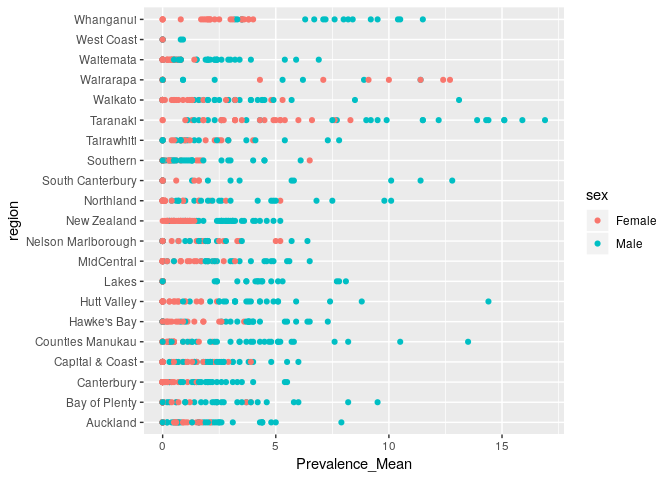

Health Mapping
================
Matt Bixley
April 12, 2019

-   [Mapping New Zealand Health Data](#mapping-new-zealand-health-data)
    -   [Plot](#plot)
-   [References](#references)

Mapping New Zealand Health Data
===============================

Lets take some health data from the [Ministry of Health](https://minhealthnz.shinyapps.io/nz-health-survey-2014-17-regional-update/_w_ffcb33f6/#!/home) Shiny App. tidy it up and plot it onto a Regional Map of New Zealand. The health website is it's own shiny app and we could do a lot of things there, but comparisons aren't so easy.

This is a reasonable chunk of data, 466245 lines with 15 columns with these headers
***population, short.description, region, type, year, agegroup, sex, Ethnicity, nzdep\_quin, Prevalence\_Mean, Prevalence\_Mean.SE, CI.Lower.Bound, CI.Upper.Bound, estimated.number, effective.sample.size***

Plot
----

lets make a super simple plot with something in the data

``` r
newdat <- hdat %>% filter(., short.description == "ADHD", type == "STD", sex != 
    "All")

ggplot(newdat, aes(Prevalence_Mean, region, col = sex)) + geom_point()
```



References
==========
